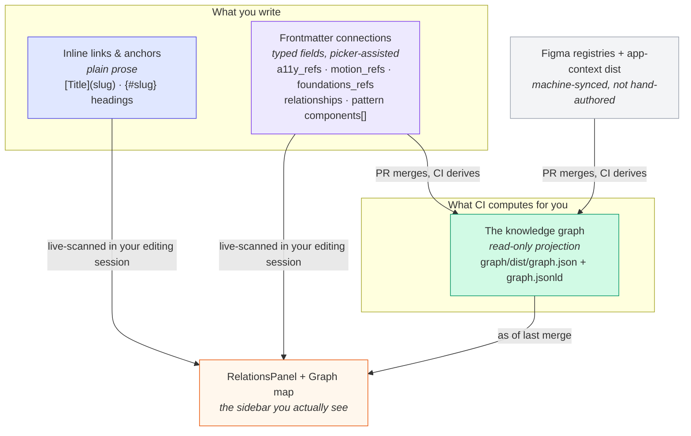
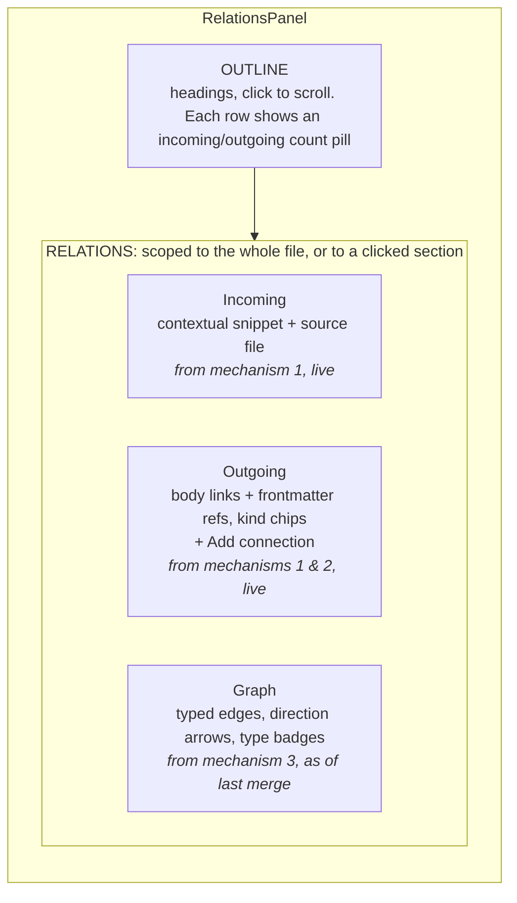
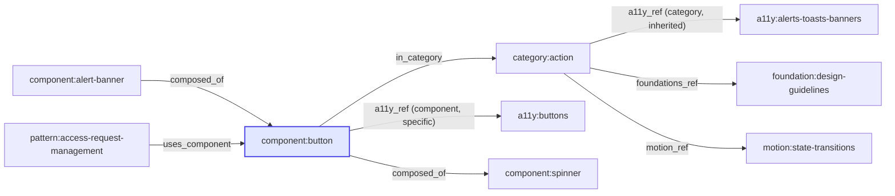

# Links, connections & the knowledge graph, explained

> **For:** anyone authoring content in the Product Knowledge Editor who has hit the Graph tab and wondered what it actually is.
> **Read time:** ~10 minutes.

The Editor gives you three different ways to connect one piece of content to another, and they are easy to conflate because they all show up in the same sidebar. This doc names them, shows how they relate, and walks a real component through all three so the "graph" stops being a black box.

## The one-sentence version

You only ever write two things by hand: a **link in your prose**, or a **typed field in frontmatter**. A third thing, **the knowledge graph**, is a read-only summary that CI computes from what you wrote. You never edit the graph directly.

## The three mechanisms

### 1. Inline links & anchors: the ones you type in prose

A markdown link, `[Loading state](spinner)`, or a section anchor: a heading tagged `{#loading-state}` that something elsewhere links to as `(spinner#loading-state)`. This is the same plain markdown a source-mode author has always written; the rich editor's `[[` autocomplete (searching component names, section anchors, everything) just inserts that same plain link for you instead of a custom syntax, so it survives the Git/PR round-trip unchanged.

**Backlinks are computed, never stored.** If your page links to `spinner`, the Editor scans every file in the session and shows *spinner's* page an "incoming" reference back to yours, a contextual snippet of the referencing paragraph, not a bare list of titles. You never maintain the reverse direction yourself.

### 2. Frontmatter connections: the ones you pick from a list

Certain relationships are important enough to be structured data instead of prose, so they live as typed fields in a file's frontmatter and are authored through a picker ("Add connection"), not typed by hand:

| Field | Lives on | Points at |
|---|---|---|
| `a11y_refs` | category / component pages | an accessibility criterion |
| `motion_refs` | category / component pages | a motion pattern |
| `foundations_refs` | category / component pages | a foundation section |
| `relationships` | app-context entities | another entity, with a named predicate (e.g. `targetsOutputPort`) |
| `components[]` | UX patterns | the components that realize the pattern |

These reference **slugs**, never quoted names (`{ref: state-transitions}`, not `"State Transitions"`): slugs survive renames, display names don't.

### 3. The knowledge graph: the one CI builds for you

Everything in the frontmatter table above, plus the Figma-synced component registries and the app-context data, gets projected by CI (`scripts/graph/derive-graph.js`) into one typed, validated graph: **`graph/dist/graph.json`**, with a linked-data sibling **`graph/dist/graph.jsonld`** (dereferenceable IRIs, reusing schema.org, SKOS, PROV-O, and WCAG vocabularies via `graph/context.jsonld`) for future tooling.

As of this writing it holds **815 nodes across 10 types** and **1,069 edges across 11 types** (see the reference tables below). It is **read-only in the Editor**: you can't add or edit an edge directly, because every edge is typed and validated against a closed vocabulary (`graph/vocabulary.json`). Each edge type only permits specific source-to-target node-type pairs, which is what keeps the graph queryable instead of a pile of ad-hoc links. Want a new connection in the graph? Author the frontmatter field it's derived from (mechanism 2) and let CI do the rest.

**This is also why the Graph group can look "behind."** Inline links and frontmatter refs are rescanned live as you type. The graph reflects the **last CI-merged state**: it updates after your PR merges and the pipeline re-derives `graph.json`, not the instant you save. The panel labels this "as of last merge" for exactly that reason.

## Where this shows up in the Editor

### The RelationsPanel

One panel, mounted beside the body editor in both rich and source mode. Two stacked groups:

### The Graph map

A small interactive diagram next to the note: the file you have open sits at the **center** (the "focus node"), and its direct graph-neighbors are placed on a ring around it (one hop out, by default). Click a neighbor to re-center the view on it and keep exploring outward. The legend at the top doubles as a filter: toggle a node type or edge type off to declutter the view. **It is not the whole 815-node graph.** It's a small, bounded neighborhood around whatever you're looking at, on purpose, so it stays readable.

## Reference: node types

| Type | Shown as | ID prefix | Real example | Count |
|---|---|---|---|---|
| `component` | Component | `component:` | `component:button` | 585 |
| `category` | Category | `category:` | `category:action` | 11 |
| `a11y_criterion` | Accessibility criterion | `a11y:` | `a11y:buttons` | 32 |
| `foundation_section` | Foundation | `foundation:` | `foundation:color-primitives` | 75 |
| `motion_pattern` | Motion pattern | `motion:` | `motion:accordion-expand-collapse` | 8 |
| `content_topic` | Content topic | `content:` | `content:empty-and-system-states` | 8 |
| `app` | Application | `app:` | `app:administration` | 3 |
| `app_entity` | Entity | `entity:` | `entity:access-request` | 30 |
| `terminology_term` | Term | `term:` | `term:access-request-policy` | 33 |
| `ux_pattern` | Pattern | `pattern:` | `pattern:access-request-management` | 30 |

*(Counts as of this writing, from `graph/dist/graph.json`: 815 nodes total. They grow as content grows; the shape doesn't.)*

## Reference: edge types

| Edge | Meaning | Source → Target | Real example | Count |
|---|---|---|---|---|
| `in_category` | Component belongs to a category | component → category | `component:button` → `category:action` | 287 |
| `composed_of` | Source nests target as a child/swappable instance | component → component | `component:button` → `component:spinner` | 325 |
| `a11y_ref` | Reference to an accessibility criterion. Scope `category` means inherited, scope `component` means specific | category/component → a11y_criterion | `component:button` → `a11y:buttons` | 86 |
| `foundations_ref` | Reference to a design foundation | category/component → foundation_section | `category:action` → `foundation:design-guidelines` | 14 |
| `motion_ref` | Reference to a motion pattern | category/component → motion_pattern | `category:action` → `motion:state-transitions` | 13 |
| `narrower` | Broader/narrower topical hierarchy (SKOS-style, not subclass or part-of) | foundation_section → foundation_section | `foundation:color-primitives` → `foundation:color-primitives/oklch-shade-formula` | 72 |
| `related` | Non-hierarchical association | content_topic → component | `content:empty-and-system-states` → `component:empty-state` | 27 |
| `in_app` | Entity or pattern belongs to a product application | app_entity/ux_pattern → app | `entity:access-request` → `app:explorer` | 93 |
| `entity_related` | Directed relationship between two domain entities. The specific relation rides the edge's `predicate` field (36 distinct predicates share this one type) | app_entity → app_entity | `entity:access-request` → `entity:output-port` (predicate `targetsOutputPort`) | 42 |
| `uses_component` | A UX pattern is realized by a DS component | ux_pattern → component | `pattern:access-request-management` → `component:button` | 93 |
| `term_about` | A term is about an entity/app/pattern, often inferred by slug match | terminology_term → app_entity/app/ux_pattern | `term:administration` → `app:administration` | 17 |

*(Counts as of this writing: 1,069 edges total. Every edge also carries `provenance`, which source file it was derived from and how, and most carry a `confidence`: `asserted` for authored facts, `inferred` for pattern-matched ones like slug-matched terms.)*

## Worked example: following Button through all three mechanisms

Reading this the way the Editor would show it if you opened Button's page:

- **In_category:** Button belongs to the **Action** category. That's a graph edge (mechanism 3), derived from the Figma-synced registry.
- **Inherited accessibility:** Action's own `a11y_refs` (frontmatter, mechanism 2) apply to every component in the category, Button included. That's what `scope: category` means.
- **Specific accessibility:** Button also carries its *own* `a11y_ref` to `a11y:buttons` (`scope: component`), for guidance that's Button-specific, not category-wide.
- **Composition, both directions:** Button can nest a Spinner for its loading state (`composed_of` outgoing), and Button itself gets nested inside things like Alert Banner (`composed_of` incoming). The Graph group in the panel shows both, with arrows for direction.
- **Usage in a pattern:** the Access Request Management pattern is realized partly by Button (`uses_component`), authored once in the pattern's frontmatter `components[]` list, then projected into the graph.

None of this required editing a graph anywhere. It's the sum of one Figma-synced registry fact (category membership and nesting) plus a couple of frontmatter fields on two different pages (Action's inherited refs, Button's own ref, the pattern's component list). All of it is plain data that CI reads and re-derives on every merge.

## Frequently asked

**Can I add a brand-new kind of relationship, or connect any two things I like?**
No. Edge types are a closed, validated vocabulary (`graph/vocabulary.json`); each one only permits specific source-to-target node-type pairs, and `scripts/graph/validate-graph.js` rejects anything else on every PR. This is what keeps 1,000+ edges trustworthy instead of a junk drawer.

**Do I have to maintain backlinks or reverse edges myself?**
No, never. Both the Incoming group (from body links) and the reverse direction of Graph edges are computed automatically. You only ever author the forward direction: a link, or a frontmatter field.

**What's actually the difference between a body link and a frontmatter ref?**
A body link is prose-level and freeform: you're linking to something for narrative reasons, inside a sentence. A frontmatter ref is a structured, typed field the data model actually knows about; it's picker-authored rather than hand-typed, and it's the one that also feeds the CI-derived graph. If a relationship needs to be *queryable* (e.g. "every component that cites this accessibility criterion"), it needs to be a frontmatter ref, not a body link.

**Why does the Graph group look different from the connection I just added?**
Because it's a projection of the last merge, not your live session (see "as of last merge" above). Your live edit is already visible under Outgoing; it reaches the Graph group once the PR merges and CI re-derives `graph.json`.

**What is the little diagram in the sidebar?**
A one-hop neighborhood map centered on whatever you have open, not the whole graph. Click a neighbor to recenter and keep exploring; use the legend to filter node/edge types out of view.

## Go deeper

- [`ARCHITECTURE.md`](ARCHITECTURE.md): the repo's four zones (Knowledge, Contract, Metadata, Tooling) and why the graph lives in "Contract"
- [`AUTHORING.md`](AUTHORING.md): the "Cross-references" section on slug-based refs
- [`graph/vocabulary.json`](graph/vocabulary.json): the closed node/edge type vocabulary, machine-readable
- [`graph/context.jsonld`](graph/context.jsonld): the linked-data `@context` for `graph.jsonld`
- [`editor/README.md`](editor/README.md): how the Editor app itself is built
